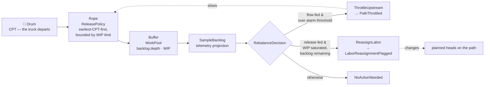

# Flow balancing

Releasing work in the right order is not enough. Once work is on the floor,
paths drift: a path staffed for 95 units/hour actually runs 70, a buffer that
should hold 20 totes holds 200, an upstream path outruns a downstream one. The
job of flow balancing is to **detect the drift and name the correction**.

## Drum-Buffer-Rope, with CPT as the drum

The model is Theory-of-Constraints Drum-Buffer-Rope, mapped onto this domain:

| DBR concept | Here |
|---|---|
| **Drum** — the constraint that sets the pace | **CPT**. The truck departs when it departs; every other rate is negotiable, that one is not. |
| **Buffer** — protective inventory in front of the constraint | The **work pool** backlog on each path. |
| **Rope** — the signal that ties release to the drum | The **release policy**: admission is pulled by the drum, not pushed by whatever arrived. |

Reading it back in plain terms: work is admitted at the pace the deadline
demands, buffers are watched to see whether that pace is being achieved, and
when a buffer says it is not, admission upstream is throttled or capacity is
moved.

## Two pool types, two levers

The single most important design point: **the corrective lever depends on which
input you actually control.**

### Flow-fed pool → `ThrottleUpstream`

Work arrives here by physical conveyance. You cannot refuse it — the tote is
already on the belt. The only lever is *upstream*: slow the admission that
feeds this path.

Trigger: `backlogDepth > alarmThreshold`. Raises `PathThrottled`.

### Release-fed pool → `ReassignLabor`

Here WES *does* control admission, and it is already exercising that control —
the WIP limit is holding, which is why WIP has hit the ceiling. Throttling
further would be pushing on a lever already fully pressed. Backlog is still
growing, so the constraint is not admission, it is **capacity**: the path needs
more heads.

Trigger: `WIP ≥ wipLimit` **and** `backlogDepth > 0`. Raises
`LaborReassignmentFlagged`.

### Otherwise → `NoActionNeeded`

Silence is a legitimate output. A recommendation engine that always
recommends something trains people to ignore it.

## The recommendation is advice, not an action

`RebalanceDecision` returns a recommendation and raises an event. It does
**not** move headcount and does not stop the release policy. That restraint is
deliberate:

- Moving headcount belongs to `workforce-management`, which owns associates,
  skills and shifts. This context stops at the path boundary.
- Throttling is a policy change, and policy changes made automatically from a
  single telemetry sample are how control loops start oscillating.

So the output is a **flag** — a named decision with the telemetry that
justified it — and a human or a downstream policy acts on it.

## Why a domain service, not a scheduled job

The obvious alternative is a batch job that sweeps every path every minute and
emits alerts. It was not built that way, for the same reason the reference model
gives for the assignment optimiser: the logic needs a cross-aggregate, near
real-time view, and it must be evaluated **at the moment someone asks**, not at
whatever moment a scheduler last fired.

A sampled sweep has a staleness window equal to its period; a decision
evaluated on read has none. And a scheduled job is untestable in the way that
matters — you end up testing the scheduler instead of the rule. As a
synchronous, pure decision over a pool snapshot, every branch of the rebalance
table above is a two-line unit test.

See [ADR-0003](../adr/0003-flow-balancing-as-domain-service.md).

## Optional labour context

`GET /paths/{pathId}/rebalance` may include a `laborPlan` object: the
`LaborPlanObserved` projection of what Workforce Management last committed for
this path. It is **additive context for the reader** — the decision logic above
does not consult it. A `ReassignLabor` flag is far more actionable next to
"Workforce last planned 7 heads here" than on its own, but letting the number
change the decision would couple this context's flow balancing to another
context's publish cadence.
