```mermaid
stateDiagram-v2
    [*] --> Pending: NewWorkUnit(id, pathId, cpt, reference)
    Pending --> Released: Release(at)
    Released --> Completed: Complete(at)
    Pending --> Pending: Release again → ErrAlreadyReleased
    Pending --> Pending: Complete → ErrNotReleased
    Released --> Released: Release again → ErrAlreadyReleased
    Completed --> Completed: Complete again → ErrAlreadyCompleted
    Completed --> Completed: Release → ErrAlreadyReleased
```

# Aggregates and invariants

Four aggregates, one domain service, five value objects. Every invariant below
is enforced *inside the domain layer* and has a failing-path unit test.

## Value objects (`internal/domain/shared`)

| Value object | Constraint | Error on violation |
|---|---|---|
| `CPT` | wraps a `time.Time`; ordering is the domain operation (`Before`, `Equals`) | — (always valid) |
| `Rate` | units/hour, must be **positive** | `ErrInvalidRate` |
| `PathId` | must be **non-empty** | `ErrInvalidPathId` |
| `Quantity` | must be **non-negative** | `ErrInvalidQuantity` |
| `StationCount` | must be **non-negative**; comparable (`LessThan`, `GreaterThan`) | `ErrInvalidStationCount` |

`hours` on a path plan is a plain `float64` but is validated to be positive
(`ErrInvalidHours`).

These exist so an illegal value cannot be constructed at all — a negative
quantity does not reach an aggregate and get rejected there; it never becomes a
`Quantity`.

---

## `ChargeForecast` — `internal/domain/charge`

The volume that must clear a process path this shift, bucketed by CPT.

```go
type CPTBucket struct {
    CPT      shared.CPT
    Quantity shared.Quantity
}

type ChargeForecast struct {   // aggregate root
    pathId     shared.PathId
    buckets    []CPTBucket
    receivedAt time.Time
}
```

### Invariants

| # | Invariant | Failing path |
|---|---|---|
| C1 | A forecast has **at least one CPT bucket** | `NewChargeForecast` with an empty slice → `ErrNoBuckets` |
| C2 | Querying a CPT that has no bucket is an error, not a zero | `QuantityForCPT(unknown)` → `ErrUnknownCPT` |

`C2` is worth a note: returning `0` for an unknown CPT would be a silent lie —
"nothing is due at 18:00" and "I have no idea what is due at 18:00" are
operationally very different answers.

### Behaviour

- `TotalQuantity()` sums across buckets.
- `Buckets()` returns a **copy**; the internal slice is never handed out, so an
  external caller cannot mutate the forecast behind its own back.

---

## `ShiftPlan` / `PathPlan` — `internal/domain/plan`

This service's committed split of headcount across process paths.

```go
type PathPlan struct {
    pathId            shared.PathId
    plannedHeads      shared.StationCount
    installedStations shared.StationCount
    rate              shared.Rate
    hours             float64
}

type ShiftPlan struct {   // aggregate root
    pathPlans []PathPlan
}
```

### Invariants

| # | Invariant | Failing path |
|---|---|---|
| P1 | **`plannedHeads ≤ installedStations`** | `NewPathPlan` with heads > stations → `ErrHeadsExceedStations` |
| P2 | `hours` must be **positive** | `NewPathPlan(hours ≤ 0)` → `ErrInvalidHours` |
| P3 | A shift plan has **at least one path plan** | `NewShiftPlan(nil)` → `ErrNoPathPlans` |

**P1 is the headline invariant of this aggregate.** It is a physical
constraint: a path has a fixed number of installed stations, and you cannot
staff more people than there are places to stand. Enforcing it at construction
means an invalid plan cannot exist even transiently — there is no "created then
validated" window.

### Behaviour

- `PathPlan.PlannedThroughput()` = `rate × plannedHeads × hours`.
- `ShiftPlan.TotalHours()` sums hours across path plans.
- `PathPlans()` returns a copy, for the same reason as `ChargeForecast`.

---

## `WorkPool` — `internal/domain/release`

The queue for exactly one process path.

```go
type WorkPool struct {   // aggregate root
    pathId         shared.PathId
    mode           FeedMode  // ReleaseFed | FlowFed
    wipLimit       int       // enforced only when mode == ReleaseFed
    alarmThreshold int       // informative only, when mode == FlowFed
    entries        []poolEntry
}
```

### Invariants

| # | Invariant | Failing path |
|---|---|---|
| W1 | **At-most-once handout.** An entry is released at most once. | `Release(id)` on an already-released entry → `ErrAlreadyReleased` |
| W2 | **WIP limit is enforceable on release-fed pools.** | `ReleaseNext()` / `Release()` when `WIP() ≥ wipLimit` and `mode == ReleaseFed` → `ErrWIPLimitReached` |
| W3 | **No duplicate entries.** | `Enqueue(id)` for an id already in the pool → `ErrDuplicateEntry` |
| W4 | Releasing from an empty pool is an error. | `ReleaseNext()` with no pending entries → `ErrEmptyPool` |
| W5 | Releasing an unknown id is an error. | `Release(unknownId)` → `ErrUnknownEntry` |

**W2 is conditional by design.** On a **flow-fed** pool the WIP limit is *not*
enforced and `alarmThreshold` is used instead, exposed as
`IsOverAlarmThreshold()`. You can only enforce a limit on an input you control;
a conveyor does not ask permission. See
[Flow balancing](../business-context/flow-balancing.md).

### Priority

`nextPendingIndex()` selects the **pending entry with the earliest CPT**. That
single rule is the entire priority function — the drum, expressed in code.

### Projections on the aggregate

`BacklogDepth()` (pending count) and `WIP()` (released count) are **computed on
demand from `entries`**, never stored. See [Read models](./read-models.md).

---

## `WorkUnit` — `internal/domain/workunit`

A releasable unit of work carrying a CPT and an external reference.

```go
type State int
const (
    Pending State = iota
    Released
    Completed
)
```



### Invariants

| # | Invariant | Failing path |
|---|---|---|
| U1 | **At most one active assignment** — a unit is released only from `Pending`. | `Release()` on a `Released` or `Completed` unit → `ErrAlreadyReleased` |
| U2 | **No double-complete.** | `Complete()` on a `Completed` unit → `ErrAlreadyCompleted` |
| U3 | **Must be released before completing.** | `Complete()` on a `Pending` unit → `ErrNotReleased` |
| U4 | Id must be non-empty. | `NewWorkUnit("")` → `ErrEmptyId` |
| U5 | Reference must be non-empty. | `NewWorkUnit(ref: "")` → `ErrEmptyReference` |

**U2 matters beyond tidiness.** Completion arrives over Kafka from
`fulfillment-execution` as `TaskCompleted`, and Kafka is at-least-once. The
inbound adapter deduplicates by `event_id` *and* the aggregate rejects the
second completion — defence in depth, deliberately. See
[Integration events](../ecosystem/integration-events.md#idempotency).

`releasedAt` and `completedAt` are recorded as nullable timestamps on
transition, so the unit carries its own lifecycle history.

---

## `ReleasePolicy` — domain service

```go
type ReleasePolicy struct{}

func (ReleasePolicy) Apply(pool *WorkPool) (string, error) {
    return pool.ReleaseNext()
}
```

It is deliberately thin *today* and deliberately **a separate object**. Release
admission is the decision most likely to change — customer tiering, cold-chain
handling, aisle batching — and the point of naming it as a domain service is
that changing it means replacing one object, not editing the pool aggregate.
See [ADR-0002](../adr/0002-waveless-continuous-release.md).

---

## Aggregate boundaries: what is *not* one aggregate

- **`WorkPool` and `WorkUnit` are separate.** The pool holds entry records
  keyed by work unit id, not `WorkUnit` objects. A pool's admission bookkeeping
  and a unit's lifecycle are different consistency boundaries that happen to be
  updated in the same use case.
- **`ChargeForecast` and `ShiftPlan` are separate.** Charge is an input fact;
  the plan is a decision. Merging them would make receiving a revised forecast
  a mutation of a committed plan.
- **Read models are not aggregates at all.** `LaborPlanObserved` and
  `UsableInventoryObserved` are plain structs with exported fields and no
  constructor, precisely because they have no invariants to protect.
