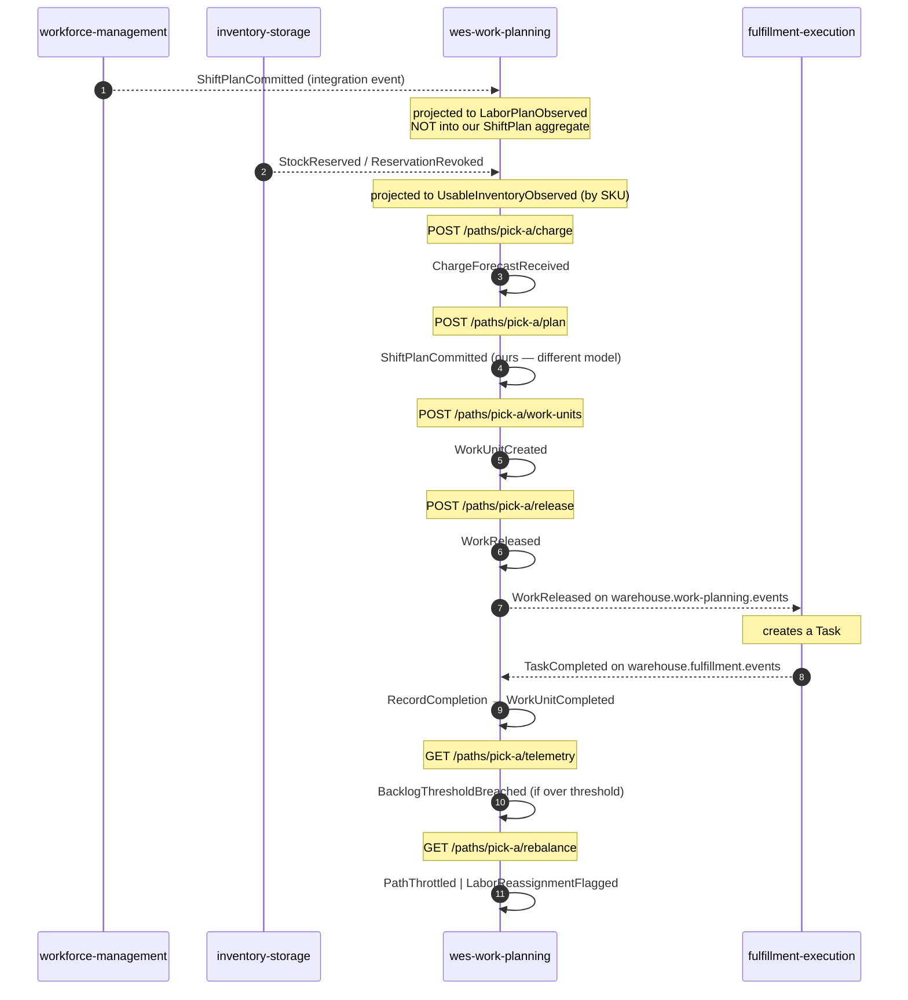

# Domain events

Nine past-tense domain events are declared in
`internal/domain/shared/events.go`. All nine implement one interface:

```go
type DomainEvent interface {
    EventName() string
    OccurredAt() time.Time
}
```

`OccurredAt` comes from the injected `Clock` port, never from `time.Now()`
inside the domain — which is why every event assertion in the test suite is
exact rather than approximate.

## The catalogue

| Event | Raised by | Payload fields | On Kafka today? |
|---|---|---|:---:|
| `ChargeForecastReceived` | `ReceiveChargeForecast` | `PathId` | ✅ |
| `ShiftPlanCommitted` | `CommitShiftPlan` | `PathId` | ✅ |
| `WorkUnitCreated` | `EnqueueWorkUnit` | `WorkUnitId`, `PathId` | ✅ |
| `WorkReleased` | `ReleaseNextWork` | `WorkUnitId`, `PathId` | ✅ **consumed downstream** |
| `WorkUnitCompleted` | `RecordCompletion` | `WorkUnitId`, `PathId` | ✅ |
| `BacklogThresholdBreached` | `SampleBacklog` | `PathId` | ✅ |
| `RateDeviationDetected` | *(declared; not yet raised by a use case)* | `PathId` | ⚠️ declared only |
| `PathThrottled` | `RebalanceDecision` (flow-fed over threshold) | `PathId` | ✅ |
| `LaborReassignmentFlagged` | `RebalanceDecision` (release-fed saturated) | `PathId` | ✅ |

:::caution Stated honestly
`RateDeviationDetected` is declared in the domain event catalogue and appears
in `apis/asyncapi.yaml`, but no use case raises it today — computing rate
deviation needs a time-windowed actual-rate projection that is not built yet.
It is documented rather than quietly dropped, because it is part of the
declared model.

Separately: Kafka publication is **opt-in at runtime** via
`EVENT_PUBLISHER=kafka`. With the default `EVENT_PUBLISHER=log`, every event
above is written to the log publisher instead. The ✅ column means "the
outbound Kafka adapter has a payload mapping for it and a use case hands it to
`EventPublisher.Publish`", not "it is flowing in your environment right now".
:::

## Which events are actually *consumed* by another service

Exactly one: **`WorkReleased`**, by `fulfillment-execution`, which turns a
released work unit into a `Task`. The rest are published for observability and
for future subscribers; nothing in the platform reads them today. Saying so is
more useful than implying a richer event mesh than exists.

## Event flow through a shift



Note the two `ShiftPlanCommitted` arrows are **different events from different
contexts** that happen to share a name — the inbound one from Workforce and the
outbound one this service raises about its own plan. See
[ADR-0006](../adr/0006-labor-plan-view-not-shift-plan.md).

## Why events carry so little

Most events carry only a `PathId`. That is intentional: a domain event is a
*fact that something happened*, and the smallest payload that identifies the
subject keeps consumers from treating the event stream as a data-replication
channel.

The one exception is the published `WorkReleased` **integration** payload,
which the outbound adapter enriches with `cpt` and `ref` by reading the work
unit — because a downstream service creating a `Task` genuinely needs the
deadline and the source reference, and forcing it to call back would make the
release path synchronous across a service boundary. That enrichment happens in
the **adapter**, not the domain event, so the domain stays ignorant of what
downstream consumers want.

## Wire format

Domain events become integration events in
`internal/adapters/outbound/kafka/publisher.go`, wrapped in the envelope shared
by all five services. The exact shapes are on the
[Events](../api/events.md) page.
