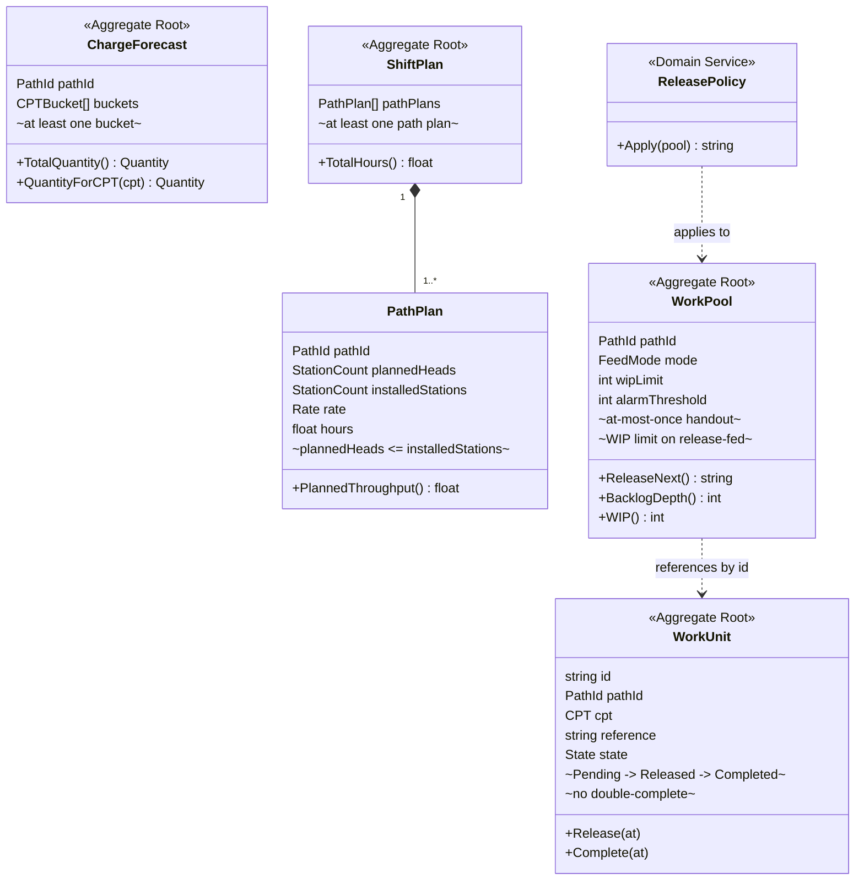

# Domain-Driven Design

This section is the tactical and strategic DDD record for the **Work Planning &
Release** bounded context. Everything here is derived from the two reference
documents that govern the platform's strategic design and from this repository's
own model — no aspirational modelling.

| Page | Contents |
|---|---|
| [Subdomain classification](./subdomain-classification.md) | Core / Supporting / Generic, with the justification |
| [Aggregates and invariants](./aggregates-and-invariants.md) | All four aggregates, every invariant, every failing path |
| [Domain events](./domain-events.md) | The nine past-tense events and who raises them |
| [Read models](./read-models.md) | Projections — and why they are never aggregate state |
| [Context relationships](./context-relationships.md) | Customer/Supplier, ACL, OHS, Conformist — the strategic patterns |

## One-page summary

Note the association style between `WorkPool` and `WorkUnit`: the pool holds
**entry records keyed by work unit id**, not `WorkUnit` objects. They are two
separate aggregates with two separate consistency boundaries, referenced by
identity — a pool's release bookkeeping and a work unit's lifecycle are updated
in the same use case but are not one transaction-shaped object.
