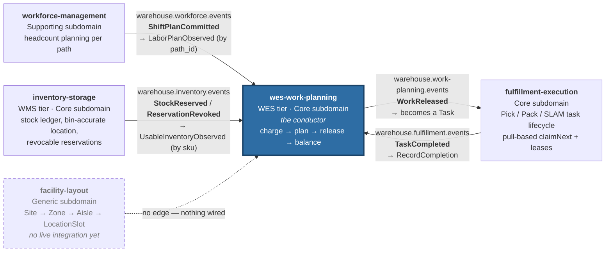
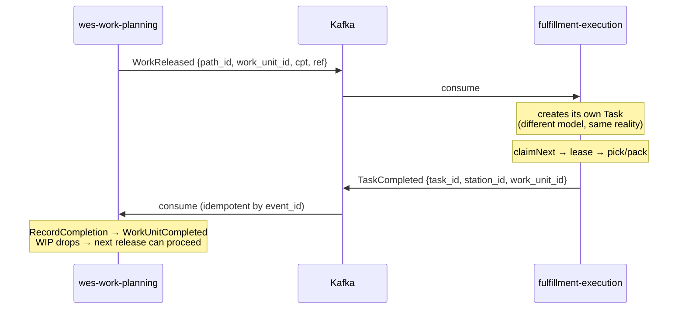
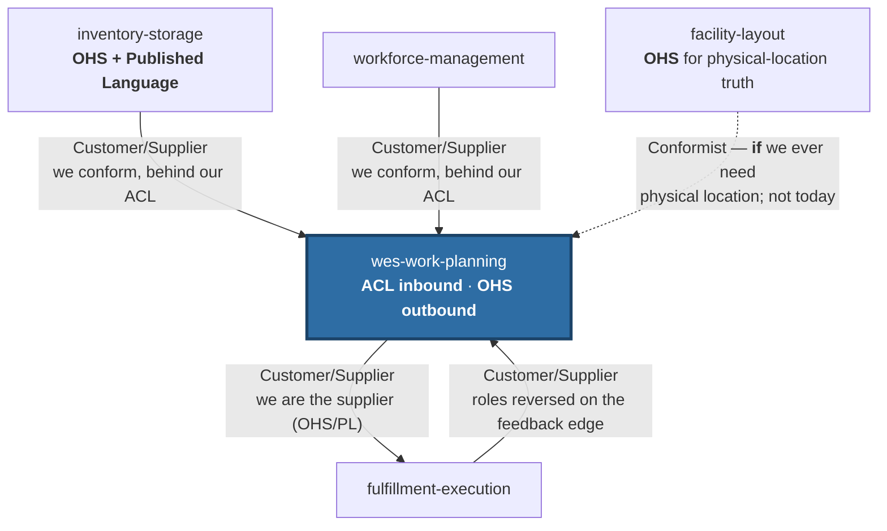

# Context map

Two things are drawn here and they are deliberately kept apart: **what is
actually wired and running**, and **what the strategic relationship is**. A
context map that blurs them is a wish list.

## What is actually wired today

Every edge below is a real Kafka topic with a real producer and a real
consumer, verified against each service's own `CLAUDE.md` and adapter code.

That is the complete set. There are **four live edges**, and every one of them
touches this service — which is what "conductor" means concretely: this is the
only context in the platform that both consumes from two upstream contexts and
participates in a closed loop with a third.

### The loop

`WorkReleased` out to Execution, `TaskCompleted` back in, is a genuine closed
control loop rather than a one-way pipeline:

The loop is what makes the WIP limit meaningful. Without the feedback edge, WIP
would only ever grow and a release-fed pool would deadlock at its limit after
`wipLimit` releases.

## Strategic relationships

The wiring above is the *mechanism*. The pattern that governs each edge, in
Evans/Vernon context-mapping terms, is the *policy* — and the two do not always
line up, which is precisely why both are drawn.

### WMS → WES is Customer/Supplier with an ACL in both directions

The platform's strategic reference states it directly: WMS is the upstream
customer of *demand* and WES the supplier of *fulfilment progress*; WMS
publishes an Open Host Service with a Published Language that WES conforms to;
and the boundary carries an **Anti-Corruption Layer in both directions** — WMS
never reaches into WES's assignment model, WES never reaches into WMS's order
or inventory aggregates.

In this repository that ACL is not a diagram box, it is
`internal/adapters/inbound/kafka/consumer.go`: unexported structs
(`inventoryEventData`, `shiftPlanCommittedData`, `taskCompletedData`) that hold
the *foreign* shape and never leave the adapter. What crosses into the
application layer is a translated call, never a foreign type.

### WES → Execution: we become the host

Downstream, the roles flip. `warehouse.work-planning.events` is *our* Open Host
Service and `WorkReleased` is *our* Published Language. Execution conforms to
it and builds its own `Task` — a different model with a different lifecycle
(leases, claims, stations), which is the correct outcome and not an accident.

### The relationship with `facility-layout` is honest about being empty

`facility-layout` is the newest service. It has **no Kafka topic, no API call
and no dependency** in either direction with this context; it publishes only to
an in-process log publisher. The dashed edge above marks a *potential*
Conformist relationship — if release ever becomes travel-aware or balancing
ever becomes congestion-aware, this context would conform to facility-layout's
location-code Published Language rather than model geography itself.

Drawing that edge as if it existed would be the most tempting and least useful
thing this page could do.

## Three-tier view

For orientation against the classic WMS/WES/WCS framing:

| Tier | Horizon | Question | Services here |
|---|---|---|---|
| **WMS** | minutes → days | what needs to happen, and why | `inventory-storage` |
| **WES** | seconds → minutes | who does it, right now, in what order | **`wes-work-planning`**, `fulfillment-execution` |
| **WCS** | ms → seconds | how the machine performs the next step | *not built* — no equipment-control service exists in this platform |

`workforce-management` (Supporting) and `facility-layout` (Generic) sit beside
the tiers rather than inside them: one supplies labour capacity to the WES tier,
the other supplies physical structure to whoever asks.
