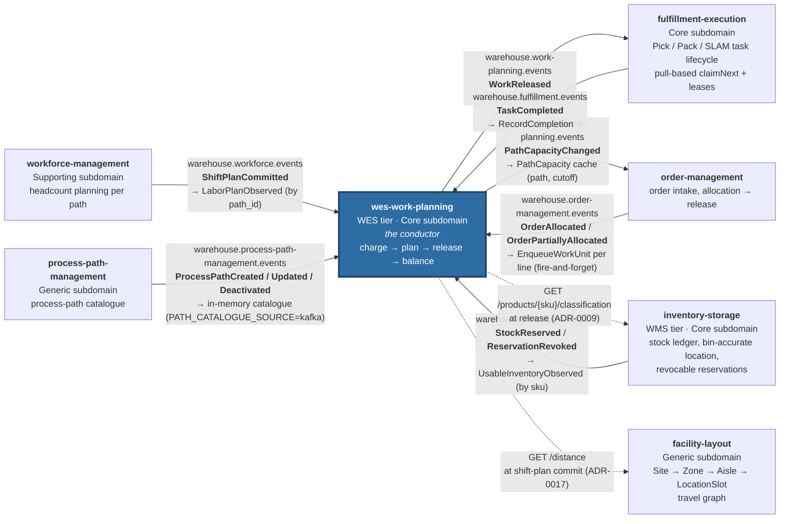
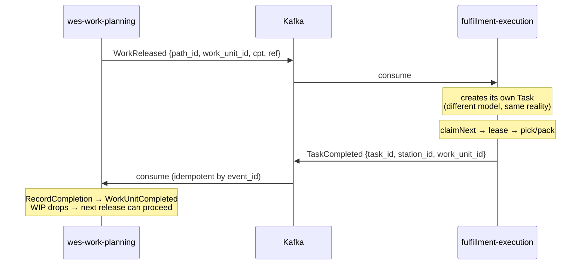
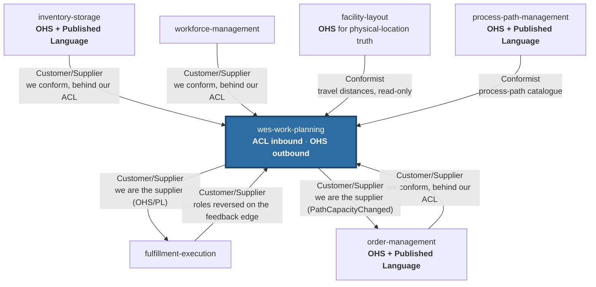

# Context map

Two things are drawn here and they are deliberately kept apart: **what is
actually wired and running**, and **what the strategic relationship is**. A
context map that blurs them is a wish list.

## What is actually wired today

Every edge below is a real Kafka topic or REST call with a real producer and
a real consumer, verified against this service's `cmd/wes/main.go` and adapter
code and against each sibling's own adapter code on `develop`. Solid edges are
Kafka; dashed edges are synchronous REST reads this service makes.

That is the complete set: **seven Kafka edges and two REST lookups**, and
every one of them touches this service — which is what "conductor" means
concretely. Both REST lookups are permissive by default
(`PRODUCT_CLASSIFICATION_MODE` / `TRAVEL_DISTANCE_MODE`) and fail open: a
lookup failure omits an optional hint and never blocks the use case.

Callers of this service's own API are not drawn: `warehouse-ops-agent` reads
the REST API (for example `GET /work-units?reference=`, the reports API) and
the MCP server, and the `warehouse-console` shell mounts this repo's `web/`
micro-frontend.

### The loop

`WorkReleased` out to Execution, `TaskCompleted` back in, is a genuine closed
control loop rather than a one-way pipeline:

The loop is what makes the WIP limit meaningful. Without the feedback edge, WIP
would only ever grow and a release-fed pool would deadlock at its limit after
`wipLimit` releases.

## Strategic relationships

The wiring above is the *mechanism*. The pattern that governs each edge, in
Evans/Vernon context-mapping terms, is the *policy* — and the two do not always
line up, which is precisely why both are drawn.

### WMS → WES is Customer/Supplier with an ACL in both directions

The platform's strategic reference states it directly: WMS is the upstream
customer of *demand* and WES the supplier of *fulfilment progress*; WMS
publishes an Open Host Service with a Published Language that WES conforms to;
and the boundary carries an **Anti-Corruption Layer in both directions** — WMS
never reaches into WES's assignment model, WES never reaches into WMS's order
or inventory aggregates.

In this repository that ACL is not a diagram box, it is
`internal/adapters/inbound/kafka/consumer.go`: unexported structs
(`inventoryEventData`, `shiftPlanCommittedData`, `taskCompletedData`,
`orderAllocatedData`) that hold the *foreign* shape and never leave the
adapter. What crosses into the application layer is a translated call, never
a foreign type.

### order-management → WES is Customer/Supplier, choreographed and fire-and-forget

`order-management` is the newest upstream context. It used to call this
service's `POST /paths/{pathId}/work-units` synchronously — a coupling this
service's owners deliberately rejected in favor of the same
publish-and-forget choreography every other upstream context already uses.
There is **no reply event**: order-management does not learn from Kafka
whether or when its lines were enqueued, only that it published. That is a
confirmed v1 design choice, not an oversight — see
[Integration events](./integration-events.md#warehouseorder-managementevents--orderallocated-orderpartiallyallocated).

### WES → Execution: we become the host

Downstream, the roles flip. `warehouse.work-planning.events` is *our* Open Host
Service and `WorkReleased` is *our* Published Language. Execution conforms to
it and builds its own `Task` — a different model with a different lifecycle
(leases, claims, stations), which is the correct outcome and not an accident.

### WES → order-management: remaining path capacity

`PathCapacityChanged` on `warehouse.work-planning.events` reports a path's
remaining admission capacity for a given CPT cutoff. order-management's
`kafkapathcapacity` adapter consumes it (its own per-process consumer group,
filtering for that one event type) and keys its cache by path and cutoff
instant. See [ADR-0018](../adr/0018-path-capacity-changed.md).

### `facility-layout` and `process-path-management`: Conformist, read-only

This context conforms to two Generic contexts without owning or reshaping
their facts:

- **facility-layout** — `CommitShiftPlan` reads the travel distance between
  two caller-supplied location codes from `GET /distance` once, at commit
  time, and stamps it onto the `PathPlan`
  ([ADR-0017](../adr/0017-travel-distance-lookup-on-commit-shift-plan.md)).
  Travel time, congestion and route choice stay here; distances stay there.
- **process-path-management** — owns the process-path catalogue. With
  `PATH_CATALOGUE_SOURCE=kafka` this service replays its topic into an
  in-memory catalogue at boot and follows it live; with the default `file`
  source it reads the same catalogue from a YAML file
  ([ADR-0012](../adr/0012-process-path-catalogue-validation.md)).

## Three-tier view

For orientation against the classic WMS/WES/WCS framing:

| Tier | Horizon | Question | Services here |
|---|---|---|---|
| **WMS** | minutes → days | what needs to happen, and why | `inventory-storage` |
| **WES** | seconds → minutes | who does it, right now, in what order | **`wes-work-planning`**, `fulfillment-execution` |
| **WCS** | ms → seconds | how the machine performs the next step | *not built* — no equipment-control service exists in this platform |

`workforce-management` (Supporting) and `facility-layout` (Generic) sit beside
the tiers rather than inside them: one supplies labour capacity to the WES tier,
the other supplies physical structure to whoever asks.
