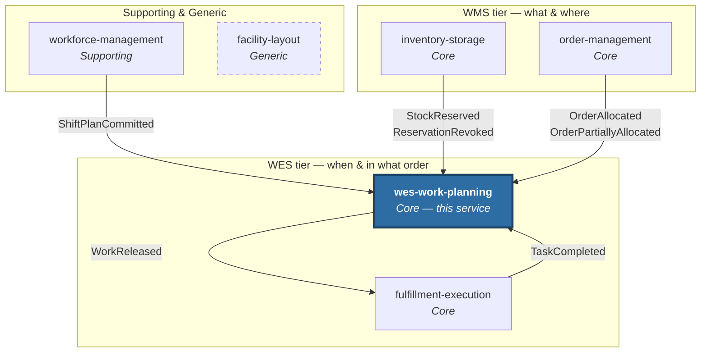

# Ecosystem

`warehouse-systems` is six Go services, each a bounded context with its own
model, its own database and its own deployment lifecycle. This one is the WES
tier's core — the conductor.

| Page | Contents |
|---|---|
| [Context map](./context-map.md) | The diagram: what is actually wired today, and what is only strategically related |
| [Integration events](./integration-events.md) | Every topic published and consumed, with real payloads and idempotency behaviour |
| [Sibling services](./sibling-services.md) | What each of the other five owns |

## The six services

Five live Kafka edges, all of them touching this service. `facility-layout`
(dashed) has no live integration with anything yet.
