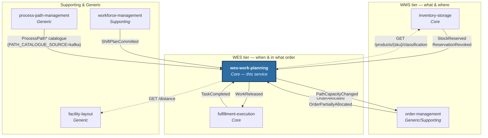

# Ecosystem

`warehouse-systems` is a fleet of Go services, each a bounded context with its
own model, its own database and its own deployment lifecycle. This one is the
WES tier's core — the conductor. This section covers the six contexts this
service integrates with directly; the others (labor-performance,
warehouse-ops-agent, network-fulfillment) have no direct edge to it beyond
calling its public API.

| Page | Contents |
|---|---|
| [Context map](./context-map.md) | The diagram: every Kafka and REST edge wired today |
| [Integration events](./integration-events.md) | Every topic published and consumed, with real payloads and idempotency behaviour |
| [Sibling services](./sibling-services.md) | What each directly integrated sibling owns |

## The directly integrated services

Solid arrows are Kafka edges, dashed arrows are REST lookups this service
makes; every one of them touches this service. See the
[context map](./context-map.md) for the relationship patterns.
