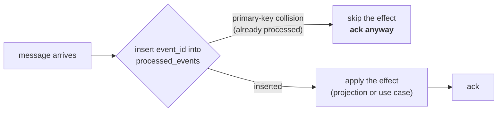

# Integration events

Every `warehouse-systems` service shares **one Kafka broker** — the
in-cluster Kafka release in the `warehouse` kind cluster, reachable from the
host at `localhost:9092`. This service does not run its own; its
`docker-compose.yml` runs Postgres only.

Client library: `github.com/segmentio/kafka-go` (pure Go, no cgo).

## The shared envelope

Every service exchanges the same outer shape:

```json
{
  "event_id": "uuid-v4",
  "event_type": "WorkReleased",
  "occurred_at": "2026-08-21T22:00:00Z",
  "source": "wes-work-planning",
  "data": { }
}
```

`event_id` is a UUID v4 generated at publish time and is also the Kafka
**message key**. `source` is always the publishing service's own name. `data`
is event-type-specific.

The envelope struct is defined in `internal/adapters/kafka/envelope` and is
**duplicated by agreement** in each service rather than extracted into a shared
library — so no service can force another to redeploy by changing a shared
dependency version.

:::note Envelope vs. the AsyncAPI spec
`apis/asyncapi.yaml` documents a CloudEvents 1.0 envelope, which is the
platform's published target contract. The running adapters use the simpler
shape above. Both are described on the [Events](../api/events.md#the-cloudevents-envelope)
page; code against the shape above if you are writing a consumer today.
:::

## Published

### Topic `warehouse.work-planning.events`

| `event_type` | `data` | Published when | Consumed by |
|---|---|---|---|
| `WorkReleased` | `{"path_id","work_unit_id","cpt","ref"}` | `ReleaseNextWork` releases a unit | **`fulfillment-execution`** → creates a `Task` |
| `PathCapacityChanged` | `{"path_id","cutoff_at","remaining_units","known"}` | `SampleBacklog` is called with `cutoffAt` set (ADR-0018) | **`order-management`** — its `kafkapathcapacity` adapter (own per-process consumer group, filters for this one event type) feeds its `ports.PathCapacity` cache, keyed by path and cutoff instant |

```json
{
  "event_id": "1d7e4b90-3c58-4d22-9a6f-8b1c0e5d7a23",
  "event_type": "WorkReleased",
  "occurred_at": "2026-08-21T22:12:30Z",
  "source": "wes-work-planning",
  "data": {
    "path_id": "pick-to-tote",
    "work_unit_id": "wu-10231",
    "cpt": "2026-08-22T02:00:00Z",
    "ref": "order-88421-line-3"
  }
}
```

`PathCapacityChanged` reports this path's currently remaining admission
capacity (its `WorkPool`'s `wipLimit` minus current WIP — always
non-negative under this aggregate's own enforced WIP-limit invariant),
correlated against a CPT cutoff timestamp — not process-path-management's
`cptId` string, which this service has zero dependency on. `known=false`
for a `FlowFed` path (no hard admission ceiling) or a `ReleaseFed` path with
no WIP limit provisioned. See [ADR-0018](../adr/0018-path-capacity-changed.md).

The other eight domain events are also written to this topic by the outbound
adapter with a `{"path_id": ...}`-shaped payload, but nothing consumes them
today. (Separately, whenever `EVENT_PUBLISHER=kafka` a second publisher also writes
every domain event, in a richer envelope, to `warehouse.wes.analytics` for the
analytics data product — see [ADR-0011](../adr/0011-analytical-data-product.md).) See the [full catalogue](../api/events.md#events-published).

Set `EVENT_PUBLISHER=kafka` (with `KAFKA_BROKERS`) to publish here; the default
`log` publisher writes the same events to the log instead. Both implement the
same `ports.EventPublisher` interface, so the use cases cannot tell which is
wired.

## Consumed

Setting `KAFKA_BROKERS` starts the consumer automatically, **independent of
`EVENT_PUBLISHER`**. It reads four topics concurrently, one goroutine each,
under the consumer group `KAFKA_CONSUMER_GROUP` (default `wes-work-planning`,
shared by every deployed replica). A second process against the shared broker
— a developer's `go run`, the e2e harness — must set a unique value, or the
rebalance hands the single partition to one member and the other consumes
nothing while reporting healthy.

With `PATH_CATALOGUE_SOURCE=kafka` a fifth, separate consumer replays
process-path-management's topic — see
[below](#warehouseprocess-path-managementevents--the-process-path-catalogue).

### `warehouse.workforce.events` — `ShiftPlanCommitted`

```json
{
  "event_id": "...", "event_type": "ShiftPlanCommitted",
  "occurred_at": "...", "source": "workforce-management",
  "data": {
    "building_id": "BLD1", "shift_id": "S1", "path_id": "pick-a",
    "planned_heads": 7, "planned_rate": 95.5, "planned_hours": 8
  }
}
```

Projected into `LaborPlanObserved`, keyed by `path_id`, read at
`GET /paths/{pathId}/labor-plan-view`. Workforce publishes **one message per
path line** of its own shift plan, which is why the projection keys on
`path_id` with one row per path.

**It is not fed into this service's `ShiftPlan` aggregate or `CommitShiftPlan`
use case.** Same word, different bounded context —
[ADR-0006](../adr/0006-labor-plan-view-not-shift-plan.md).

### `warehouse.inventory.events` — `StockReserved`, `ReservationRevoked`

```json
{
  "event_id": "...", "event_type": "StockReserved",
  "occurred_at": "...", "source": "inventory-storage",
  "data": {"sku": "SKU-8891", "quantity": 4, "demand_ref": "order-88421"}
}
```

Both types carry the same `data` shape. `StockReserved` **decrements** the
observed usable count for that SKU; `ReservationRevoked` **increments** it
back. Projected into `UsableInventoryObserved`, keyed by **SKU**, read at
`GET /inventory-view/{sku}`.

Keyed by SKU and not by path deliberately: Inventory reservations are
SKU-scoped, and a SKU-to-path mapping does not exist in the domain.

### `warehouse.fulfillment.events` — `TaskCompleted`

```json
{
  "event_id": "...", "event_type": "TaskCompleted",
  "occurred_at": "...", "source": "fulfillment-execution",
  "data": {"task_id": "t-551", "station_id": "pack-3", "work_unit_id": "wu-10231"}
}
```

`data.work_unit_id` maps to `RecordCompletionRequest.WorkUnitId` and calls the
**existing** `RecordCompletion` use case — the exact code path
`POST /work-units/{id}/complete` uses. No new use case; the inbound adapter is
the only new thing.

### `warehouse.order-management.events` — `OrderAllocated`, `OrderPartiallyAllocated`

```json
{
  "event_id": "...", "event_type": "OrderAllocated",
  "occurred_at": "...", "source": "order-management",
  "data": {
    "order_id": "order-1", "promise_date": "2026-08-22T02:00:00Z",
    "lines": [{"line_no": 1, "sku": "SKU-1", "path_id": "pick-a", "gift_wrap": false}]
  }
}
```

Both event types share this identical `data` shape and are handled
identically — both mean "these lines are ready to enqueue". This is the
event-choreography replacement for order-management's former **synchronous**
call to `POST /paths/{pathId}/work-units`: order-management (a new, 6th
bounded context, upstream Customer of this service) now publishes here once
it has allocated stock and locally marked an order line Released.

For each entry in `lines`, the handler calls the **existing** `EnqueueWorkUnit`
use case directly (no new use case), deriving a **deterministic**
`work_unit_id` as `"{order_id}-line-{line_no}"` — so the same order line
always maps to the same work unit, which is a second line of defense against
duplicate enqueues on top of the `processed_events` idempotency guard (see
below).

This integration is deliberately **fire-and-forget**: there is no reply event
back to order-management. The existing `WorkUnitCreated`/`WorkReleased`
events already published on `warehouse.work-planning.events` remain the only
observable signal of downstream progress — the same signal every other
`EnqueueWorkUnit` caller (including the REST endpoint) already relies on.
This was a confirmed v1 design choice made when rejecting order-management's
former synchronous HTTP coupling, not an oversight.

### `warehouse.process-path-management.events` — the process-path catalogue

Consumed only when `PATH_CATALOGUE_SOURCE=kafka` (the default `file` source
reads the same catalogue from YAML instead). The
`internal/adapters/outbound/kafkacatalog` consumer replays the topic from the
beginning under its own per-process consumer group — not
`KAFKA_CONSUMER_GROUP` — folding `ProcessPathCreated`, `ProcessPathUpdated`
and `ProcessPathDeactivated` into the in-memory `pathcatalog.Catalogue` that
validates every `pathId`
([ADR-0012](../adr/0012-process-path-catalogue-validation.md)). Startup blocks
until the replay has caught up, then the consumer keeps following the topic
live. It is a state-rebuild, not an effect, so it does not use
`processed_events`.

## Idempotency

Kafka is at-least-once, so redelivery is normal, not exceptional. Every
consumer path here is idempotent by construction:



- **Postgres**: table `processed_events (event_id TEXT PRIMARY KEY, processed_at
  TIMESTAMPTZ)`, added by its own migration. The primary-key violation *is* the
  duplicate check — no read-then-write race.
- **In-memory**: a mutex-guarded `map[string]struct{}` with the same semantics.

Both sit behind one port, `ProcessedEventRepo.TryMarkProcessed(ctx, eventId,
at) (alreadyProcessed bool, err error)`.

Observable consequences, each covered by a unit test:

| Redelivered event | Effect |
|---|---|
| `StockReserved` | usable quantity is **not** double-decremented |
| `ReservationRevoked` | usable quantity is **not** double-incremented |
| `ShiftPlanCommitted` | the labour projection is **not** re-written |
| `TaskCompleted` | `RecordCompletion` is **not** called a second time |
| `OrderAllocated` / `OrderPartiallyAllocated` | `EnqueueWorkUnit` is **not** called a second time per line |

The last one matters operationally: `WorkUnit.Complete` already rejects
double-completion with `ErrAlreadyCompleted`, so the aggregate would be safe
regardless. But without the `event_id` check, every redelivery would surface a
domain error from a perfectly normal Kafka behaviour, and an error that is
sometimes meaningless is an error nobody reads. Deduplicating first keeps
`ErrAlreadyCompleted` meaning what it says.

## Configuration

| Env var | Default | Effect |
|---|---|---|
| `KAFKA_BROKERS` | *(unset)* | Comma-separated brokers. **Setting it starts the inbound consumer.** |
| `KAFKA_CONSUMER_GROUP` | `wes-work-planning` | Consumer group of the integration-event consumer; set a unique value for any second process on the shared broker. |
| `EVENT_PUBLISHER` | `log` | `kafka` switches the outbound publisher; requires `KAFKA_BROKERS`. |
| `PATH_CATALOGUE_SOURCE` | `file` | `kafka` replays `warehouse.process-path-management.events` into the catalogue; requires `KAFKA_BROKERS`. |

## Verifying it end to end

There is a build-tagged integration test (`//go:build integration`) that
publishes real `ShiftPlanCommitted`- and `StockReserved`-shaped messages and
asserts the read models update, plus one for the Kafka-backed process-path
catalogue. Both start their own Kafka broker with testcontainers, so they need
Docker but no environment variables; the default `go test ./...` never needs a
broker:

```sh
go test -tags=integration ./internal/adapters/inbound/kafka/... ./internal/adapters/outbound/kafkacatalog/...
```

For a manual smoke test, see [Running locally](../overview/running-locally.md#connecting-to-the-shared-kafka-broker).
