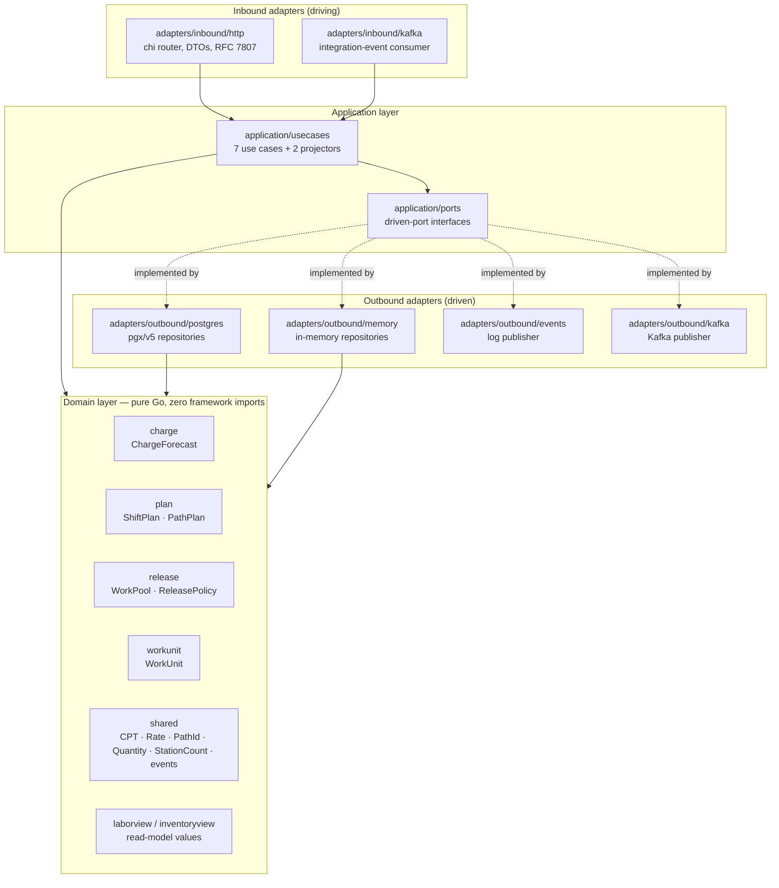

# Hexagonal layering

The repository is organised strictly as **ports & adapters**. The dependency
rule is non-negotiable and *executable* — it is asserted by architecture
fitness tests in CI, not just documented ([ADR-0007](../adr/0007-arch-go-fitness-tests.md)).

> **domain** depends on nothing · **application** depends on domain ·
> **adapters** depend on application and domain · only `cmd/` wires everything



## Package map

```
cmd/wes/                        main.go — the only place every layer meets
internal/
  domain/                       pure Go: aggregates, value objects, events, errors
    charge/                     ChargeForecast aggregate
    plan/                       ShiftPlan + PathPlan aggregates
    release/                    WorkPool aggregate + ReleasePolicy domain service
    workunit/                   WorkUnit aggregate
    shared/                     CPT, Rate, PathId, Quantity, StationCount, DomainEvent
    laborview/                  LaborPlanObserved read-model value
    inventoryview/              UsableInventoryObserved read-model value
  application/
    ports/                      driven-port interfaces (repos, publisher, clock)
    usecases/                   one struct per use case
  adapters/
    inbound/http/               chi router, DTOs, domain-error → HTTP mapping
    inbound/kafka/              integration-event consumer (3 topics)
    outbound/postgres/          pgxpool repository implementations
    outbound/memory/            thread-safe in-memory repositories
    outbound/events/            log/buffered EventPublisher
    outbound/kafka/             Kafka EventPublisher
    kafka/envelope/             the wire envelope shared by both Kafka adapters
  architecture/                 arch-go fitness tests
migrations/                     golang-migrate SQL files
apis/                           openapi.yaml + asyncapi.yaml (the published contracts)
features/                       godog (Gherkin) acceptance specs
```

## The driven ports

Every outbound dependency is an interface owned by the **application** layer,
so the domain never learns that Postgres or Kafka exist:

| Port | Purpose |
|---|---|
| `ChargeRepo` | persist/retrieve `ChargeForecast`, one per path |
| `PlanRepo` | persist/retrieve `ShiftPlan`, one per path |
| `WorkPoolRepo` | persist/retrieve `WorkPool`, one per path |
| `WorkUnitRepo` | persist/retrieve `WorkUnit` by id and by path |
| `EventPublisher` | publish domain events (`log` or `kafka` implementation) |
| `Clock` | abstract "now" so use cases and tests are deterministic |
| `LaborPlanViewRepo` | persist the `LaborPlanObserved` projection, one per path |
| `InventoryViewRepo` | atomically apply a delta to `UsableInventoryObserved`, keyed by SKU |
| `ProcessedEventRepo` | record consumed `event_id`s so redelivery is a no-op |

Each of the first six has both an in-memory and a Postgres/Kafka
implementation; the composition root picks one per environment variable.

## Why this shape

The reason is not tidiness — it is that the interesting rules of this domain
(priority by CPT, at-most-once handout, WIP limits, `plannedHeads ≤
installedStations`) are *decisions*, and decisions belong somewhere with no
infrastructure in it, so they can be exercised exhaustively and cheaply. The
domain and application packages carry the bulk of the test suite precisely
because they have no I/O to mock. See
[ADR-0001](../adr/0001-hexagonal-ports-and-adapters.md).
