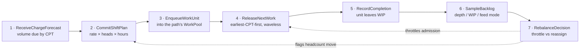

# What this service does

The bounded context exposes exactly **seven use cases**. They form a single
closed control loop: plan → release → observe → correct.

## The seven use cases

### 1. `ReceiveChargeForecast(path, cptBuckets)`

Records the **charge** for a process path: a set of `(CPT, quantity)` pairs.
Not "total due today" — the bucketing by CPT is the whole point, because
release priority is derived from CPT and nothing else.

Produces the `ChargeForecast` aggregate. Requires at least one bucket
(`ErrNoBuckets`).

### 2. `CommitShiftPlan(path, heads, rate, hours)`

Commits this service's own split of headcount across a process path: planned
heads, service rate (units/hour) and hours. Enforces the aggregate invariant
`plannedHeads ≤ installedStations` — you cannot plan more people onto a path
than it has physical stations.

Produces the `ShiftPlan` aggregate (a collection of `PathPlan` values).
`PathPlan.PlannedThroughput()` = `rate × heads × hours`.

:::note Not Workforce Management's ShiftPlan
This service's `ShiftPlan` is a *different model* from the `ShiftPlan` in the
`workforce-management` bounded context, despite the shared word. See
[ADR-0006](../adr/0006-labor-plan-view-not-shift-plan.md).
:::

### 3. `EnqueueWorkUnit(path, cpt, ref)`

Creates a `WorkUnit` in state `Pending` carrying its CPT and an external
reference (e.g. the source order line), and enqueues it in that path's
`WorkPool`.

### 4. `ReleaseNextWork(path)`

Applies the `ReleasePolicy` **domain service** to the path's `WorkPool`. The
pool hands out the pending entry with the **earliest CPT** — at most once —
and, on a *release-fed* pool, refuses when WIP is already at the pool's WIP
limit (`ErrWIPLimitReached`).

This is the waveless heart of the service: there is no wave, no batch window,
no schedule. Admission is a **policy applied continuously on demand**. See
[ADR-0002](../adr/0002-waveless-continuous-release.md).

Emits `WorkReleased`, which is the one event published onto Kafka today.

### 5. `RecordCompletion(workUnitId)`

Transitions a `Released` work unit to `Completed`. The aggregate rejects
double-completion (`ErrAlreadyCompleted`) and completion of a unit that was
never released (`ErrNotReleased`).

Reachable two ways: `POST /work-units/{id}/complete`, or a `TaskCompleted`
event consumed from `fulfillment-execution` — the same use case, called from a
different inbound adapter.

### 6. `SampleBacklog(path)`

Returns the live telemetry **read model**: backlog depth (pending entries),
WIP (released-but-not-complete entries), feed mode, and whether the pool is
over its alarm threshold. Raises `BacklogThresholdBreached` when it is.

This is a **projection computed from pool state**, not a field stored on an
aggregate — see [Read models](../ddd/read-models.md).

### 7. `RebalanceDecision(path)`

The flow-balancing recommendation, computed from the same live telemetry:

| Pool feed mode | Condition | Recommendation | Event raised |
|---|---|---|---|
| Flow-fed | backlog depth > alarm threshold | `ThrottleUpstream` | `PathThrottled` |
| Release-fed | WIP ≥ WIP limit **and** backlog > 0 | `ReassignLabor` | `LaborReassignmentFlagged` |
| either | otherwise | `NoActionNeeded` | — |

Two different pool types get two different corrective levers, because they
have two different controllable inputs. See
[Flow balancing](../business-context/flow-balancing.md) and
[ADR-0003](../adr/0003-flow-balancing-as-domain-service.md).

## What this service deliberately does *not* do

- **Inventory truth** — owned by `inventory-storage`. This service only keeps
  a read-only SKU-keyed projection of what Inventory last reported.
- **Workforce scheduling / individual labor assignment** — owned by
  `workforce-management`. This service only keeps a read-only path-keyed
  projection of the labor plan Workforce last committed.
- **Task dispatch to a station or associate** — owned by
  `fulfillment-execution`. This service releases a *work unit*; turning that
  into a claimable `Task` happens downstream.
- **Equipment control** — the WCS tier; out of scope for the whole platform
  as built today.
- **HATEOAS** — the REST API is deliberately Richardson Maturity Level 2
  (resource nouns, correct verbs, correct status codes) with no hypermedia
  controls.
